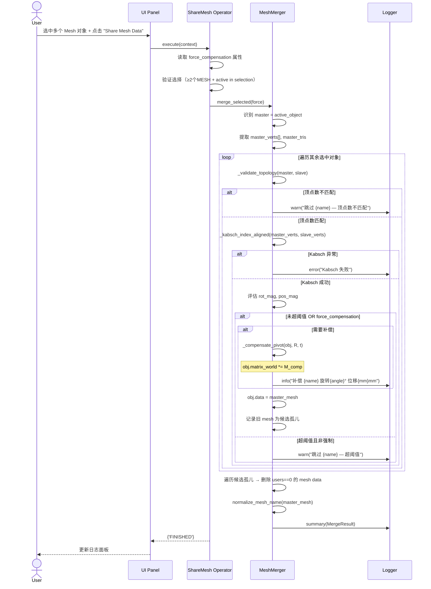
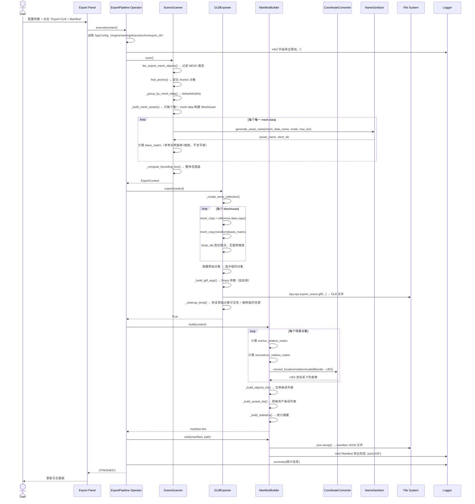
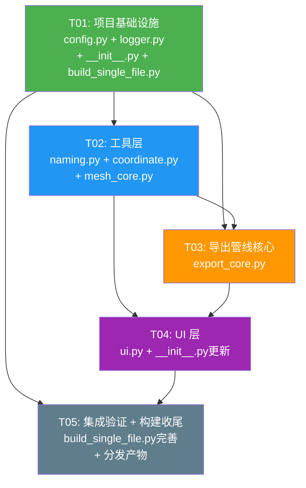

# Blender Mesh Toolkit — 系统架构设计与任务分解

> **架构师**: Bob | **日期**: 2025-06-29 | **目标平台**: Blender 4.0+

---

## Part A：系统设计

---

### 1. 实现方案与框架选型

#### 1.1 核心挑战分析

| 难点 | 分析 | 解决路径 |
|------|------|----------|
| **单文件分发 vs 多模块开发** | 最终分发为单个 .py 文件，但 10+ 个功能点不宜全写在一个巨型文件中 | 开发期采用多模块包结构，发布时通过 `build_single_file.py` 合并为单一 .py |
| **Kabsch 算法依赖 numpy** | Blender 内置 Python **不含** numpy | 采用运行时检测 + 优雅降级：优先使用 numpy（已在 Blender Python 环境安装），无 numpy 时提供纯 Python SVD 回退（仅小矩阵 3×3 可行） |
| **拓扑不一致递归合并** | PRD 要求"安全跳过 + 递归合并子集"，传统一维分组不够 | 按 mesh data 分组后，对每组内部再做拓扑一致性子集检测，形成多级合并链 |
| **Draco 压缩参数跨 Blender 版本** | `export_scene.gltf` 的 Draco 参数名在 Blender 4.0/4.1/4.2 之间有过变化 | 在 config 中提供版本自适应参数表，运行时检测 bpy.app.version |
| **坐标系转换可扩展性** | 需求 UE5 优先但预留 Unity/Godot | 采用"引擎预设注册表"模式：每个引擎定义 axis_mapping + handedness + unit_scale 三元组，新增引擎仅加配置无需改逻辑 |

#### 1.2 架构模式选择：**多模块包 + 构建合并**

```
开发期结构                      分发产物
───────────                    ──────────
SimpleBleModlePlugin/           mesh_toolkit.py
├── __init__.py    ──┐           (build_single_file.py
├── config.py      ──┤            合并所有模块，
├── logger.py      ──┤            去除构建脚本本身，
├── naming.py      ──┤            保留完整 bl_info +
├── coordinate.py  ──┼─ merge →   所有注册逻辑)
├── mesh_core.py   ──┤
├── export_core.py ──┤
├── ui.py          ──┤
└── build_single_file.py (不进入产物)
```

**为什么选这个方案？**

| 对比维度 | 单文件巨型脚本 | 多模块包 + 合并 |
|----------|---------------|-----------------|
| 开发可维护性 | ❌ 1000+ 行混在一起 | ✅ 职责分离，每文件 150-300 行 |
| 团队协作 | ❌ 冲突集中 | ✅ 不同人可并行改不同模块 |
| Blender 插件兼容性 | ✅ 直接可用 | ✅ 合并后与单文件等价 |
| Blender Preferences 集成 | ⚠️ 需手动拼装 | ✅ `__init__.py` 天然支持 `register()` |
| 测试友好性 | ❌ 无法独立测试 | ✅ 每个模块可独立 import 测试 |

#### 1.3 关键技术选型

- **UI 框架**: Blender 原生 `bpy.types.Panel` + `bpy.types.Operator`（无第三方 UI 库）
- **数学库**: numpy（主路径）+ 纯 Python SVD 回退（3×3 Jacobi SVD）
- **序列化**: 标准库 `json`（manifest）+ Blender 内置 glTF exporter（GLB）
- **命名处理**: 标准库 `re` + `hashlib`
- **构建工具**: 自写 `build_single_file.py`，AST 级别 import 重写 + 文件拼接

---

### 2. 文件列表

```
SimpleBleModlePlugin/                    # 插件根目录
│
├── __init__.py                          # Blender addon 入口：bl_info, register(), unregister()
│                                        #   AddonPreferences 定义（阈值/导出目录/默认引擎等持久化设置）
│
├── config.py                            # 全局常量与配置定义
│                                        #   Draco 压缩预设表、命名模式枚举、坐标系统定义、
│                                        #   默认阈值、Blender 版本自适应参数表、引擎预设注册表
│
├── logger.py                            # 统一日志模块
│                                        #   双通道输出（System Console + Info Area）、
│                                        #   时间戳格式化、操作统计摘要、警告/错误分级
│
├── naming.py                            # 资产命名与规范化模块
│                                        #   sanitize_ue5_name()、generate_asset_name()、
│                                        #   normalize_mesh_name()、命名模式策略（ORIGINAL/
│                                        #   HASH/PREFIX_HASH/SHORTID_PREFIX）、
│                                        #   引擎合规命名（特殊字符过滤、长度截断、去重下划线）
│
├── coordinate.py                        # 坐标系转换模块
│                                        #   引擎预设注册表（UE5/Unity/Godot/Custom）、
│                                        #   双向转换函数（loc/quat/scale）、
│                                        #   右手/左手系翻转、单位缩放
│
├── mesh_core.py                         # 网格核心操作模块
│                                        #   拓扑验证（顶点数 + 三角形数校验）、
│                                        #   INDEX Kabsch 算法（numpy + 纯 Python 回退）、
│                                        #   枢轴补偿（阈值判定 + 强制补偿模式）、
│                                        #   递归子集合并、孤立数据清理
│
├── export_core.py                       # 导出核心模块
│                                        #   场景扫描与分组（SceneScanner）、
│                                        #   Anchor 对象定位、导出上下文构建、
│                                        #   GLB 导出（临时 Collection + Mesh Basis bake）、
│                                        #   Manifest JSON 构建（实例变换/包围盒/材质/统计摘要）
│
├── ui.py                                # UI 面板与操作符定义
│                                        #   主面板 MESH_TOOLKIT_PT_MainPanel（N面板 Tab）
│                                        #   子面板：Mesh Management / Export Pipeline / Log / Settings
│                                        #   操作符：Share Mesh / Clean Orphan / Normalize Names /
│                                        #           Export GLB+Manifest / 强制补偿开关
│
└── build_single_file.py                 # 构建脚本（仅开发期使用，不进入分发产物）
                                         #   递归扫描源文件 → 重写内部 import →
                                         #   合并为单一 mesh_toolkit.py 用于分发
```

---

### 3. 数据结构与接口

```mermaid
classDiagram
    direction TB

    %% ── 配置 ──
    class AppConfig {
        <<singleton>>
        +float pos_threshold
        +float rot_threshold
        +bool force_compensation
        +str naming_mode
        +str precision_mode
        +str target_engine
        +str export_dir
        +str anchor_name
        +bool include_hidden
        +int max_name_length
        +get_draco_preset() dict
        +get_engine_preset() dict
    }

    %% ── 日志 ──
    class Logger {
        <<static>>
        +log(msg, level) void
        +info(msg) void
        +warn(msg) void
        +error(msg) void
        +summary(stats) void
    }

    %% ── 命名 ──
    class NameSanitizer {
        <<static>>
        +sanitize_engine_name(name, engine) str
        +generate_asset_name(mesh_data_name, mode, max_len) tuple
        +normalize_mesh_name(name) str
        +short_mesh_id(name) str
        -_truncate_smart(text, max_len) str
        -_strip_invalid_chars(name, engine) str
    }

    %% ── 坐标 ──
    class CoordinateConverter {
        <<static>>
        +ENGINE_PRESETS dict
        +convert_location(loc, src, dst) list
        +convert_rotation(quat, src, dst) list
        +convert_scale(scale, src, dst) list
        +convert_matrix(matrix, src, dst) Matrix
        +register_engine(name, preset) void
    }

    %% ── 合并结果 ──
    class MergeResult {
        +int reassigned
        +int pos_compensated
        +int rot_compensated
        +int skipped
        +int errors
        +int orphans_removed
        +list error_details
        +to_dict() dict
    }

    %% ── 网格合并器 ──
    class MeshMerger {
        +AppConfig config
        +merge_selected(force) MergeResult
        +clean_orphans() int
        +normalize_all_names() int
        -_kabsch_index_aligned(master, slave) tuple
        -_validate_topology(a, b) bool
        -_compensate_pivot(obj, R, t) void
        -_recursive_merge(group, master) MergeResult
        -_find_topology_subset(objects, master) list
    }

    %% ── 网格资产 ──
    class MeshAsset {
        +str mesh_data_name
        +str short_id
        +str asset_name
        +Object reference_obj
        +int instance_count
        +Matrix basis_matrix
        +list material_names
        +int material_count
    }

    %% ── 导出上下文 ──
    class ExportContext {
        +list mesh_objects
        +Object anchor_obj
        +Matrix anchor_matrix
        +Matrix anchor_inverse
        +list mesh_assets
        +dict mesh_assets_by_data
        +dict bounding_box
    }

    %% ── 场景扫描器 ──
    class SceneScanner {
        +AppConfig config
        +scan() ExportContext
        +find_anchor() Object
        -_group_by_mesh_data(objects) dict
        -_compute_bounding_box(objects) dict
        -_build_mesh_assets(groups) list
    }

    %% ── GLB 导出器 ──
    class GLBExporter {
        +AppConfig config
        +export(context) bool
        -_create_temp_collection() Collection
        -_bake_and_place(asset) Object
        -_cleanup_temp(col, objs, meshes) void
        -_build_gltf_args() dict
    }

    %% ── Manifest 构建器 ──
    class ManifestBuilder {
        +AppConfig config
        +build(context) dict
        +write(manifest, path) void
        -_build_objects_list(context) list
        -_build_assets_list(context) list
        -_build_statistics(context) dict
        -_serialize_blender_transform(matrix) dict
        -_serialize_ue5_transform(matrix) dict
    }

    %% ── UI 面板 ──
    class MESH_TOOLKIT_PT_MainPanel {
        +draw(context) void
    }
    class MESH_TOOLKIT_PT_MeshMgmt {
        +draw(context) void
    }
    class MESH_TOOLKIT_PT_Export {
        +draw(context) void
    }
    class MESH_TOOLKIT_PT_Log {
        +draw(context) void
    }

    %% ── 操作符 ──
    class MESH_TOOLKIT_OT_ShareMesh {
        +execute(context) set
        +force_compensation bool
    }
    class MESH_TOOLKIT_OT_CleanOrphans {
        +execute(context) set
    }
    class MESH_TOOLKIT_OT_NormalizeNames {
        +execute(context) set
    }
    class MESH_TOOLKIT_OT_ExportPipeline {
        +execute(context) set
    }

    %% ── 关系 ──
    MeshMerger --> AppConfig : uses
    MeshMerger --> Logger : uses
    MeshMerger --> NameSanitizer : uses
    MeshMerger --> MergeResult : creates

    SceneScanner --> AppConfig : uses
    SceneScanner --> ExportContext : creates
    SceneScanner --> MeshAsset : creates

    GLBExporter --> AppConfig : uses
    GLBExporter --> ExportContext : uses
    GLBExporter --> Logger : uses

    ManifestBuilder --> AppConfig : uses
    ManifestBuilder --> ExportContext : uses
    ManifestBuilder --> CoordinateConverter : uses
    ManifestBuilder --> NameSanitizer : uses

    MESH_TOOLKIT_OT_ShareMesh --> MeshMerger : invokes
    MESH_TOOLKIT_OT_CleanOrphans --> MeshMerger : invokes
    MESH_TOOLKIT_OT_NormalizeNames --> MeshMerger : invokes
    MESH_TOOLKIT_OT_ExportPipeline --> SceneScanner : invokes
    MESH_TOOLKIT_OT_ExportPipeline --> GLBExporter : invokes
    MESH_TOOLKIT_OT_ExportPipeline --> ManifestBuilder : invokes

    MESH_TOOLKIT_PT_MeshMgmt --> MESH_TOOLKIT_OT_ShareMesh : contains
    MESH_TOOLKIT_PT_MeshMgmt --> MESH_TOOLKIT_OT_CleanOrphans : contains
    MESH_TOOLKIT_PT_MeshMgmt --> MESH_TOOLKIT_OT_NormalizeNames : contains
    MESH_TOOLKIT_PT_Export --> MESH_TOOLKIT_OT_ExportPipeline : contains
```



---

### 4. 程序调用流程

#### 4.1 网格共享合并流程（P0-1/P0-2/P0-3/P1-6）



#### 4.2 GLB + Manifest 导出流程（P0-4/P0-5/P0-6/P1-1/P1-2/P1-4/P1-5）



---

### 5. 待明确事项（Anything UNCLEAR）

| # | 问题 | 假设/建议 | 影响范围 |
|---|------|-----------|----------|
| 1 | **递归合并的深度** | 建议仅做**一级递归**：在同一个 mesh data group 内找出所有拓扑一致的子集分别合并，不再对子子集递归（避免组合爆炸） | mesh_core.py `_recursive_merge()` |
| 2 | **强制补偿后的枢轴差异过大** | 建议给 LARGE 级别（旋转 >45°）加一个确认对话框 `bpy.context.window_manager.invoke_confirm()` | ui.py 操作符 |
| 3 | **Unity preset 的坐标系定义** | 假设 Unity 为 Y-up 左手系（与 UE5 Z-up 不同），转换公式需确认：`Unity_loc = (Bl_x, Bl_z*100, Bl_y*100)` | coordinate.py ENGINE_PRESETS |
| 4 | **Anchor 对 merge 阶段的影响** | 假设 Anchor 仅用于**导出阶段**的参考系，merge 阶段不受 Anchor 影响 | export_core.py |
| 5 | **导出目录不存在时的行为** | 建议自动创建（`os.makedirs(exist_ok=True)`），与参考代码一致 | export_core.py |
| 6 | **build_single_file.py 的 import 重写策略** | 使用正则匹配 `from .module import` 并替换为内联，跨文件函数名冲突通过模块前缀避免 | build_single_file.py |
| 7 | **Blender 4.0 最低版本** | Blender 4.0 使用 Python 3.10，`bpy.types.AddonPreferences` API 在 4.0 中已稳定。`temp_override` 在 4.0 中可用 | 全局 |

---

## Part B：任务分解

---

### 6. 依赖包列表

```
# Blender 内置（无需安装）
bpy                 # Blender Python API（4.0+）
mathutils           # 向量/矩阵数学（blender 内置）
json                # 标准库
os, re, time, datetime  # 标准库
hashlib             # 标准库
collections         # 标准库（defaultdict）
pathlib             # 标准库
ast                 # 标准库（build_single_file.py 用）

# 需要用户安装到 Blender Python 环境
numpy               # Kabsch SVD 计算（主路径，可选：无 numpy 时自动退化到纯 Python 3×3 SVD）
```

安装 numpy 到 Blender Python 的命令（用户首次使用前执行一次）：

```bash
# Windows
"C:\Program Files\Blender Foundation\Blender 4.0\4.0\python\bin\python.exe" -m pip install numpy

# macOS
/Applications/Blender.app/Contents/Resources/4.0/python/bin/python3.11 -m pip install numpy
```

---

### 7. 任务列表（按依赖排序）

#### T01 — 项目基础设施：配置、日志、入口骨架、构建脚本

| 字段 | 内容 |
|------|------|
| **Task ID** | T01 |
| **Task Name** | 项目基础设施（配置 + 日志 + 入口 + 构建） |
| **Source Files** | `config.py`, `logger.py`, `__init__.py`, `build_single_file.py` |
| **Dependencies** | 无 |
| **Priority** | P0 |
| **对应 PRD** | 全部（基础设施） |

**实现内容**：

1. **`config.py`** — 全局常量与配置定义
   - Draco 压缩预设表（NONE/LOSSLESS/SUPER_HIGH/HIGH/BALANCED/AGGRESSIVE），含 Blender 4.0/4.1/4.2 版本自适应参数兼容
   - 命名模式枚举：`ORIGINAL`, `HASH`, `PREFIX_HASH`, `SHORTID_PREFIX`
   - 引擎坐标系预设注册表（UE5 完整 + Unity/Godot 骨架占位）
   - 默认阈值：`POS_THRESHOLD=0.001`, `ROT_THRESHOLD=0.015`
   - 默认导出参数：`EXPORT_DIR`, `ANCHOR_NAME="UE_Anchor"`, `MAX_NAME_LENGTH=80`

2. **`logger.py`** — 统一日志模块
   - `log(msg, level="INFO")` — 双通道输出：`print()` 到 System Console + `bpy.ops.wm.report()` 到 Info Area
   - 自动时间戳前缀 `[HH:MM:SS]`
   - `info()`, `warn()`, `error()` 快捷方法
   - `summary(stats: dict)` — 格式化输出操作统计摘要

3. **`__init__.py`** — Blender addon 入口骨架
   - `bl_info` 字典（name="Mesh Toolkit", author, version=(1,0,0), blender=(4,0,0), location="3D View > N Panel > Mesh Toolkit"）
   - `register()` / `unregister()` 骨架（类注册用 `bpy.utils.register_class` 遍历列表）
   - `MeshToolkitPreferences(bpy.types.AddonPreferences)` — 持久化设置类骨架（阈值、导出目录、默认引擎、Draco 模式等 property 定义）
   - `draw()` 方法绘制 Preferences UI

4. **`build_single_file.py`** — 开发期构建脚本
   - 递归收集插件目录下所有 `.py` 文件（排除自身）
   - 将 `from .xxx import` / `import .xxx` 形式的相对导入替换为内联（AST 或正则）
   - 合并为单个 `mesh_toolkit.py`，末尾追加 `if __name__ == "__main__": register()`
   - 输出到指定路径（默认 `dist/mesh_toolkit.py`）

---

#### T02 — 工具层：命名规范化 + 坐标系转换 + 网格核心算法

| 字段 | 内容 |
|------|------|
| **Task ID** | T02 |
| **Task Name** | 工具层（命名 + 坐标 + 网格核心） |
| **Source Files** | `naming.py`, `coordinate.py`, `mesh_core.py` |
| **Dependencies** | T01（依赖 config.py 的常量定义和 logger.py 的日志输出） |
| **Priority** | P0 |
| **对应 PRD** | P1-2, P1-4, P1-6, P0-6, P0-1, P0-2, P0-3 |

**实现内容**：

1. **`naming.py`** — 资产命名与规范化（约 200 行）
   - `sanitize_engine_name(name, engine="UE5")` — 引擎合规命名过滤（特殊字符正则、长度限制、去重下划线）
   - `generate_asset_name(mesh_data_name, mode, max_length)` — 四种命名策略：
     - `ORIGINAL`: 原始名称 + sanitize，超出则截断
     - `HASH`: `SM_{glb_basename}_{short_id}`
     - `PREFIX_HASH`: `SM_{sanitized_prefix}_{short_id}`，前缀超长时智能删段
     - `SHORTID_PREFIX`: `SM_{short_id}_{truncated_prefix}`
   - `normalize_mesh_name(name)` — 去除 `__数字` 后缀（regex `r'__[0-9].*$'`）
   - `short_mesh_id(name)` — 生成 8 位 MD5 短 ID（`M{hex[:8]}`）
   - 辅助函数：`_truncate_smart()`, `_segment_deletion_score()`, `_classify_segment_chars()`

2. **`coordinate.py`** — 坐标系转换（约 120 行）
   - `ENGINE_PRESETS` 注册表 dict：
     ```python
     {
       "UE5":    {"up": "Z", "handedness": "left",  "unit_scale": 100.0, "axis_map": (1,0,2)},
       "Unity":  {"up": "Y", "handedness": "left",  "unit_scale": 100.0, "axis_map": (2,0,1)},
       "Godot":  {"up": "Y", "handedness": "right", "unit_scale": 1.0,   "axis_map": (2,0,1)},
       "Custom": {"up": "Z", "handedness": "right", "unit_scale": 1.0,   "axis_map": (2,1,0)},
     }
     ```
   - `convert_location(loc, src="BLENDER", dst="UE5")` — 位置转换
   - `convert_rotation(quat, src="BLENDER", dst="UE5")` — 四元数转换
   - `convert_scale(scale, src="BLENDER", dst="UE5")` — 缩放转换
   - `convert_matrix(matrix, src, dst)` — 完整 4×4 矩阵转换
   - `register_engine(name, preset)` — 注册新引擎（扩展点）
   - Blender 内部统一用 `"BLENDER"` 作为源坐标系标识符

3. **`mesh_core.py`** — 网格核心操作（约 300 行）
   - **`MeshMerger` 类**：
     - `__init__(config)` — 注入 AppConfig
     - `merge_selected(force=False)` → `MergeResult` — 主合并流程
     - `clean_orphans()` → `int` — 清理孤立 mesh data，返回删除数
     - `normalize_all_names()` → `int` — 规范化所有 mesh data 名称，返回改名数
     - `_kabsch_index_aligned(master_verts, slave_verts)` → `(R, t)`
       - 优先 numpy SVD 路径
       - 回退纯 Python 3×3 Jacobi SVD（numpy 未安装时）
     - `_validate_topology(a, b)` → `bool` — 顶点数 + 三角形数校验
     - `_compensate_pivot(obj, R, t)` — 应用 `matrix_world @ M_comp` 补偿
     - `_recursive_merge(group, master)` — 递归子集合并（一级递归：对 group 中拓扑与 master 不一致的对象，两两比对找一致子集）
     - `_find_topology_subset(objects, master)` → `list` — 找出与 master 拓扑一致的对象子集
   - **`MergeResult` 数据类**：
     - `reassigned`, `pos_compensated`, `rot_compensated`, `skipped`, `errors`, `orphans_removed`
     - `error_details: list[dict]` — 包含 `{object_name, reason}`
     - `to_dict()` — 序列化为 dict 供日志使用

---

#### T03 — 导出核心：场景扫描 + GLB 导出 + Manifest 构建

| 字段 | 内容 |
|------|------|
| **Task ID** | T03 |
| **Task Name** | 导出管线核心（扫描 + GLB + Manifest） |
| **Source Files** | `export_core.py` |
| **Dependencies** | T01, T02（依赖 config/naming/coordinate/logging 全部模块） |
| **Priority** | P0 |
| **对应 PRD** | P0-4, P0-5, P1-1, P1-5 |

**实现内容**（单文件 ~400 行，按类分节）：

1. **`MeshAsset` 数据类**：
   - `mesh_data_name`, `short_id`, `asset_name`, `reference_obj`, `instance_count`, `basis_matrix`, `material_names`, `material_count`

2. **`ExportContext` 数据类**：
   - `mesh_objects`, `anchor_obj`, `anchor_matrix`, `anchor_inverse`, `mesh_assets`, `mesh_assets_by_data`, `bounding_box`

3. **`SceneScanner` 类**：
   - `__init__(config)` — 注入 AppConfig
   - `scan()` → `ExportContext` — 主扫描流程
   - `find_anchor()` → `Object|None` — 按 `ANCHOR_OBJECT_NAME` 查找
   - `_group_by_mesh_data(objects)` → `dict` — 按 `obj.data.name` 分组
   - `_build_mesh_assets(groups)` → `list[MeshAsset]` — 构建资产元数据
   - `_compute_bounding_box(objects)` → `dict` — 世界空间包围盒

4. **`GLBExporter` 类**：
   - `__init__(config)` — 注入 AppConfig
   - `export(context: ExportContext)` → `bool` — GLB 导出主流程
   - `_create_temp_collection()` → `Collection` — 创建临时 Collection
   - `_bake_and_place(asset: MeshAsset)` → `Object` — mesh copy + basis transform + 归零放置
   - `_build_gltf_args()` → `dict` — 构建 `export_scene.gltf` 的参数（含 Draco）
   - `_cleanup_temp(col, objs, meshes)` — 恢复场景 + 删除临时资源（含 finally 安全保证）

5. **`ManifestBuilder` 类**：
   - `__init__(config)` — 注入 AppConfig
   - `build(context: ExportContext)` → `dict` — 构建完整 manifest
   - `write(manifest, path)` — 写入 JSON 文件
   - `_build_objects_list(context)` → `list[dict]` — 实例条目（含 anchor_relative + reconstruct_relative + UE5 变换）
   - `_build_assets_list(context)` → `list[dict]` — 资产条目
   - `_build_statistics(context)` → `dict` — 统计摘要（total_objects, unique_mesh_data_blocks, shared_instances…）
   - `_serialize_blender_transform(matrix)` → `dict` — Blender 坐标序列化
   - `_serialize_ue5_transform(matrix)` → `dict` — UE5 坐标序列化（调用 CoordinateConverter）

---

#### T04 — UI 层：面板 + 操作符 + 偏好设置集成

| 字段 | 内容 |
|------|------|
| **Task ID** | T04 |
| **Task Name** | UI 层（面板 + 操作符 + 偏好设置） |
| **Source Files** | `ui.py`, `__init__.py`（更新注册逻辑） |
| **Dependencies** | T01, T02, T03（所有业务模块完成后才能绑定 UI） |
| **Priority** | P0 |
| **对应 PRD** | P0-7, UI 设计概要全部 |

**实现内容**（约 350 行）：

1. **操作符定义**（`ui.py` 内，或可选拆为 `operators.py`）：
   - `MESH_TOOLKIT_OT_ShareMesh(bpy.types.Operator)` — P0-1, P0-2
     - `bl_idname = "mesh_toolkit.share_mesh_data"`
     - `force_compensation: bpy.props.BoolProperty`
     - `execute()` → 调用 `MeshMerger.merge_selected(force)`
   - `MESH_TOOLKIT_OT_CleanOrphans(bpy.types.Operator)` — P0-3
     - `bl_idname = "mesh_toolkit.clean_orphan_data"`
     - `execute()` → 调用 `MeshMerger.clean_orphans()`
   - `MESH_TOOLKIT_OT_NormalizeNames(bpy.types.Operator)` — P1-6
     - `bl_idname = "mesh_toolkit.normalize_mesh_names"`
     - `execute()` → 调用 `MeshMerger.normalize_all_names()`
   - `MESH_TOOLKIT_OT_ExportPipeline(bpy.types.Operator)` — P0-4, P0-5
     - `bl_idname = "mesh_toolkit.export_pipeline"`
     - `execute()` → SceneScanner → GLBExporter → ManifestBuilder 管线
     - 导出进度通过 `Logger` 实时输出

2. **面板定义**（`ui.py` 内）：
   - `MESH_TOOLKIT_PT_MainPanel` — N 面板 Tab（`bl_category = "Mesh Toolkit"`）
   - `MESH_TOOLKIT_PT_MeshManagement` — 子面板：
     - "Share Mesh Data" 按钮 + 强制补偿 checkbox
     - POS_THRESHOLD / ROT_THRESHOLD 滑块（读取 Preferences）
     - "Clean Orphan Data" 按钮
     - "Normalize Mesh Names" 按钮
   - `MESH_TOOLKIT_PT_ExportPipeline` — 子面板：
     - Target Engine 下拉（UE5/Unity/Godot/Custom）
     - Anchor Object Name 文本框
     - Export Directory 路径选择
     - Draco Compression 下拉
     - Naming Mode 下拉
     - "Export GLB + Manifest" 按钮
   - `MESH_TOOLKIT_PT_LogStatus` — 子面板：
     - 滚动文本区域（`bpy.types.UILayout.template_list` 或静态 `label` 显示最近 20 条日志）
     - "Clear Log" 按钮
   - `MESH_TOOLKIT_PT_Settings` — 子面板：
     - 指向 `bpy.ops.screen.userpref_show('ADDONS')` 的按钮

3. **`__init__.py` 更新**（在 T01 骨架基础上）：
   - 注册列表整合所有 4 个 Panel + 4 个 Operator
   - `MeshToolkitPreferences` 补全所有 property：
     - `pos_threshold: FloatProperty(default=0.001, min=0.0, max=1.0, precision=4)`
     - `rot_threshold: FloatProperty(default=0.015, min=0.0, max=3.14, precision=4)`
     - `target_engine: EnumProperty(items=[("UE5","Unreal Engine 5",""),("Unity","Unity",""),("Godot","Godot",""),("Custom","Custom","")])`
     - `export_dir: StringProperty(subtype='DIR_PATH')`
     - `naming_mode: EnumProperty(items=...)`
     - `precision_mode: EnumProperty(items=...)`
     - `anchor_name: StringProperty(default="UE_Anchor")`
     - `max_name_length: IntProperty(default=80, min=10, max=200)`
   - Preferences `draw()` 方法：布局所有设置项

---

#### T05 — 集成验证、构建脚本完善、单文件分发产物

| 字段 | 内容 |
|------|------|
| **Task ID** | T05 |
| **Task Name** | 集成验证 + 构建脚本收尾 + 分发产物生成 |
| **Source Files** | `build_single_file.py`（完善）, `config.py`（版本标记）, `__init__.py`（收尾） |
| **Dependencies** | T01, T02, T03, T04（所有模块） |
| **Priority** | P1 |
| **对应 PRD** | 全部（集成验证 + 分发准备） |

**实现内容**：

1. **`build_single_file.py` 完善**：
   - 完善 import 重写逻辑：将 `from .xxx import A, B, C` 提取为内联代码（提取被引用符号的定义并内联到调用位置，或保留完整模块内联并添加模块命名空间前缀）
   - 最终策略选择：**完整模块内联 + 在函数名前加 `_mod_` 前缀防止冲突**（更稳健）
   - 或者：直接按文件依赖拓扑排序后将文件内容拼接，仅移除 `from .xxx import` 语句（因为所有代码已在同一命名空间）
   - **推荐最终策略**：按拓扑排序拼接文件 → 移除所有 `from .module import` 行 → 移除 `if __name__` 块 → 追加 `if __name__ == "__main__": register()`
   - 输出文件 `dist/mesh_toolkit.py`
   - 添加文件头注释（版本、构建日期、源文件列表）

2. **`config.py` 更新**：
   - 添加 `__version__ = "1.0.0"` 与 `__build_date__`（构建时注入）

3. **分发产物验证**：
   - 确保 `dist/mesh_toolkit.py` 可独立在 Blender 中作为 addon 安装
   - 验证所有 `bl_info` 元数据正确

---

### 8. 共享知识（Shared Knowledge）

```yaml
# ── 错误处理策略 ──
error_handling:
  kabsch_failure: "捕获异常 → Logger.error → 跳过当前对象 → 继续处理下一个"
  glb_export_failure: "捕获异常 → Logger.error → cleanup临时资源 → 返回False → 不写Manifest"
  missing_numpy: "导入时静默捕获 → 设置USE_NUMPY=False → 自动退化到纯Python SVD"
  invalid_selection: "操作符execute()中早期返回{'CANCELLED'} + Logger.warn说明原因"

# ── 命名规范 ──
naming:
  addon_id: "mesh_toolkit"
  operator_bl_idname: "mesh_toolkit.{action_name}"
  panel_bl_idname: "MESH_TOOLKIT_PT_{panel_name}"
  class_prefix: "MESH_TOOLKIT_"

# ── 数据流约定 ──
data_flow:
  forward: "AppConfig(持久化) → 业务模块(通过__init__注入) → 返回结构化结果"
  config_access: "所有模块通过构造函数的config参数接收AppConfig，不使用全局变量"

# ── Blender API 使用约定 ──
blender_api:
  temp_override: "bpy.context.temp_override(window=w) 用于 report，兼容 Blender 4.0+"
  matrix_world: "所有世界空间变换读写使用 obj.matrix_world（非 matrix_basis + matrix_local）"
  mesh_data_access: "读取 obj.data.vertices[i].co；写入仅通过 obj.data = new_mesh"
  selection_management: "操作前后保存/恢复用户选择状态（bpy.context.selected_objects）"

# ── Manifest JSON 结构约定 ──
manifest_schema:
  version: "3.0"
  format: "anchor_mesh_basis_manifest"
  coordinate_system: "{} # 描述源和目标坐标系"
  scene_anchor: "{} # Anchor 对象信息"
  mesh_assets: "[]# 唯一 mesh data 条目"
  objects: "[]# 场景实例条目"
  statistics: "{}# 统计摘要"
  bounding_box: "{}# 场景包围盒"

# ── GLB 导出约定 ──
glb_export:
  bake_rotation_and_scale: true  # Mesh Basis 烘焙旋转+缩放
  bake_translation: false        # 保留正常 pivot（不烘焙平移）
  export_yup: true               # 启用 glTF Y-up 转换
  temp_collection_name: "_mesh_toolkit_export_temp_"
  selection_restore: true        # 导出后恢复用户原始选择

# ── 构建约定 ──
build:
  source_root: "SimpleBleModlePlugin/"
  output_dir: "dist/"
  output_filename: "mesh_toolkit.py"
  excluded_files: ["build_single_file.py", "__pycache__", "*.pyc"]
  merge_strategy: "拓扑排序拼接 + 移除相对import + 追加if __name__"

# ── 扩展点预留（P2 需求） ──
extension_points:
  engine_presets: "CoordinateConverter.ENGINE_PRESETS 字典可通过 register_engine() 动态添加"
  naming_modes: "NameSanitizer.generate_asset_name() 的 mode 参数支持新策略字符串扩展"
  export_formats: "GLBExporter 可继承/替换为 FBXExporter（P2-3）"
  config_presets: "AppConfig 预留 to_dict()/from_dict() 方法用于预设保存/加载（P2-1）"
```

---

### 9. 任务依赖图



**说明**：
- T01 是唯一无依赖的任务，必须先完成
- T02 和 T03 都依赖 T01，但彼此可**部分并行**（T03 最终需要 T02 的 naming + coordinate，但可在 T02 开发期间先写好框架）
- T04 依赖 T02+T03 的全部功能完成后才能绑定操作符
- T05 依赖所有模块完成后才能最终构建
- 关键路径：T01 → T02 → T03 → T04 → T05

---

> **文档版本**: v1.0 | **最后更新**: 2025-06-29 | **下一步**: 交由 Engineer 按 T01→T05 顺序实现
